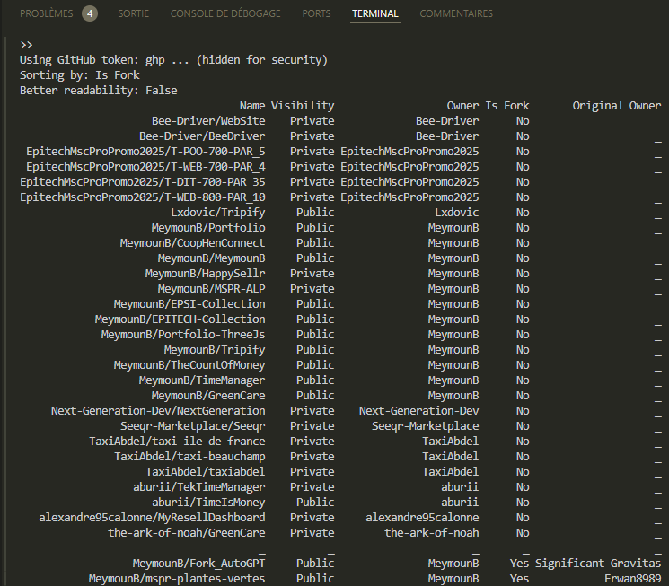

<!-- markdownlint-disable MD029 -->

# Suivi des contributions aux dépôts GitHub

[](https://github.com/MeymounB/GitHub-Contributions/blob/main/README.fr.md)
[](https://github.com/MeymounB/GitHub-Contributions/blob/main/README.md)

Ce projet vous permet de récupérer et d'afficher les dépôts GitHub auxquels vous avez contribué, en utilisant l'API GraphQL de GitHub. Le script est configuré pour afficher les dépôts dans un tableau, avec des options de tri et une lisibilité améliorée.

## Aperçu du projet

Ce script récupère tous les dépôts auxquels vous avez contribué sur GitHub et les affiche dans un format de tableau structuré. Il prend en charge diverses options de tri et un mode de lisibilité améliorée.

## Fonctionnalités

- Récupérer les dépôts auxquels vous avez contribué.
- Afficher les dépôts dans un format de tableau structuré.
- Trier les dépôts selon différents critères.
- Améliorer la lisibilité avec des lignes vides optionnelles entre les groupes.
- Générer une sortie visuelle du tableau.

## Configuration et utilisation

### Prérequis

- Python 3.x
  - [Linux](https://www.python.org/downloads/source/)
  - [macOS](https://www.python.org/downloads/macos/)
  - [Windows](https://www.python.org/downloads/windows/)
- Git
  - [Windows](https://git-scm.com/download/win)
  - [macOS](https://git-scm.com/download/mac)
  - [Linux](https://git-scm.com/download/linux)
- Un token d'accès personnel GitHub avec les autorisations appropriées (expliqué ci-dessous)

(Les liens ci-dessus ne redirigent que vers des pages de documentation. Ils ne vous font pas télécharger de fichiers/dossiers)

### Installation

1. Clonez le dépôt sur votre machine locale :

   ```bash
   git clone https://github.com/MeymounB/github-repo-contributions-tracker.git
   cd github-repos-contributions
   ```

2. Créez et activez un environnement virtuel :

   - Sur **Windows** :

     ```bash
     python -m venv venv
     venv\Scripts\activate
     ```

   - Sur **macOS** et **Linux** :

     ```bash
     python3 -m venv venv
     source venv/bin/activate
     ```

3. Installez les dépendances :

   ```bash
   pip install -r requirements.txt
   ```

### Optionnel : Installation globale des dépendances (Windows)

Si vous préférez installer les dépendances globalement et que vous avez des privilèges d'administrateur sur Windows, vous pouvez exécuter la commande suivante :

```bash
pip install -r requirements.txt --user
```

### Obtention d'un token d'accès personnel GitHub

Pour utiliser ce script, vous aurez besoin d'un token d'accès personnel GitHub. Voici les étapes pour obtenir ce token :

1. Accédez à la page [GitHub Personal Access Tokens](https://github.com/settings/tokens).

2. Cliquez sur ["Generate new token"](https://github.com/settings/tokens/new) (classique).

3. Remplissez les champs requis :

- **Note** : Donnez un nom à votre token pour le reconnaître facilement.
- **Expiration** : Choisissez une période d'expiration pour le token.
- **Select scopes** : Sélectionnez les autorisations nécessaires. Les autorisations recommandées pour ce script sont :
  - `repo`
  - `read:user`
  - `user:email`
  - `public_repo`

4. Cliquez sur "Generate token".

5. Copiez le token généré et conservez-le dans un endroit sûr. Vous en aurez besoin pour configurer le script.

### Configuration

1. Créez un fichier `.env` dans le répertoire du projet avec le contenu suivant :

   ```plaintext
   GITHUB_TOKEN=your_github_personal_access_token
   SORT_BY=Owner  # Changez cette valeur en "Name", "Visibility", "Owner", "Is Fork", ou "Original Owner"
   BETTER_READABILITY=true  # Changez cette valeur en "true" ou "false"
   ```

2. Remplacez `your_github_personal_access_token` par votre token d'accès personnel GitHub.

### Utilisation

1. Exécutez le script Python :

   ```bash
   python github_contributions.py
   ```

### Exemple de sortie

Voici un exemple de la sortie générée par le script (sortie terminal) :



Voici un exemple de la sortie générée par le script (sortie fichier) :


## Options de tri

- `Name` : Trie les dépôts par nom.
- `Visibility` : Trie les dépôts par visibilité (Privé ou Public).
- `Owner` : Trie les dépôts par propriétaire.
- `Is Fork` : Trie les dépôts selon s'ils sont des forks ou non.
- `Original Owner` : Trie les dépôts par le propriétaire original (pour les forks).

## Options de lisibilité améliorée

- `BETTER_READABILITY=true` : Ajoute des lignes vides entre les différents groupes pour améliorer la lisibilité.

## Contribution

Les contributions sont les bienvenues ! N'hésitez pas à soumettre des issues ou des pull requests.

## Licence

Ce projet est sous licence MIT. Voir le fichier [LICENSE](LICENSE) pour plus de détails.

## Avertissement

Les informations fournies dans ce dépôt sont uniquement à des fins d'information générale.
Toutes les informations de ce dépôt sont fournies de bonne foi, cependant nous ne faisons aucune représentation
ou garantie d'aucune sorte, expresse ou implicite, concernant l'exactitude, l'adéquation, la validité, la fiabilité,
la disponibilité ou l'exhaustivité de toute information dans ce dépôt.

En aucune circonstance, nous n'aurons aucune responsabilité envers vous pour toute perte ou dommage de toute nature
subi à la suite de l'utilisation du site ou de la confiance accordée à toute information fournie sur le site.
Votre utilisation du site et votre confiance en toute information sur le site sont uniquement à vos propres risques.

Si vous cliquez sur les liens fournis dans le markdown ou suivez les instructions et téléchargez
ou installez un logiciel, cela se fait à vos propres risques. Nous ne sommes pas responsables de tout dommage
à votre ordinateur, perte de données ou tout autre problème pouvant survenir suite à la suivi des instructions
ou à l'utilisation des liens fournis.

(Même si rien ne cause de dommage à votre ordinateur, je ne peux pas vous le garantir)

## Contact

Pour toute assistance ou question, veuillez contacter [Meymoun] à [boualaoui.meymoun.icn@gmail.com].
